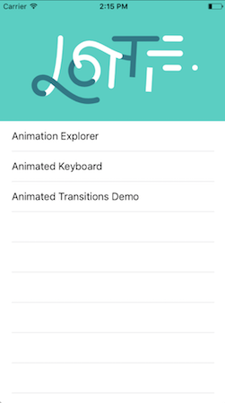
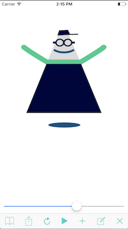
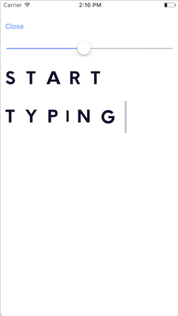
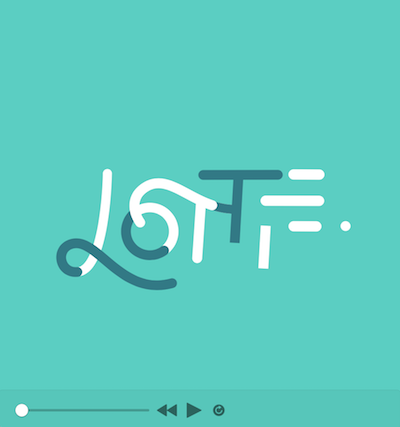
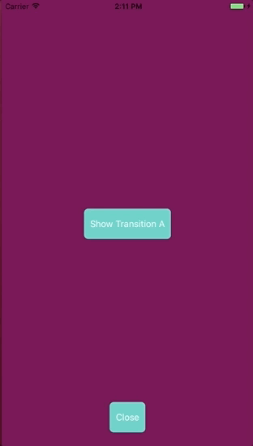
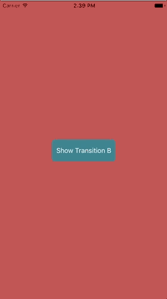
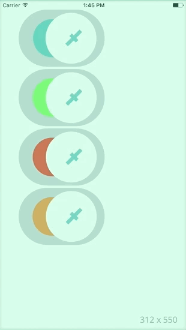
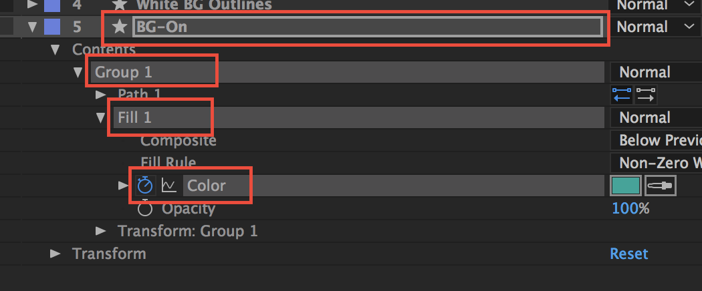
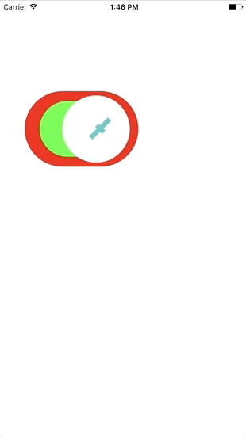
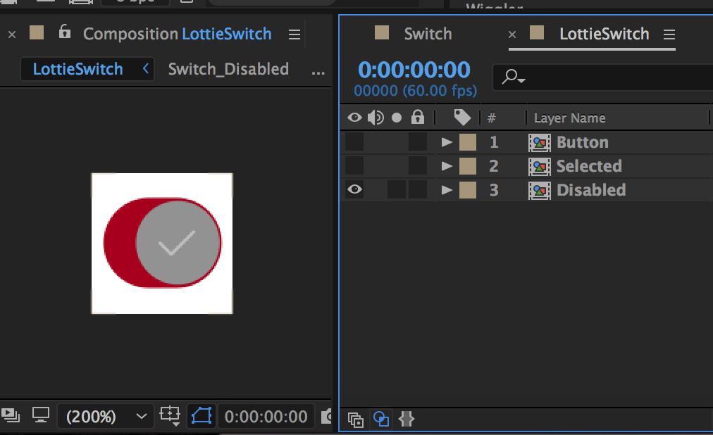

## 自己研发自己推广。欢迎点击跳转App Store安装。
### 一、iPhone/iPad端安装
>[1、iTelevision （更好用的直播流播放器/手机电视）](https://apps.apple.com/cn/app/itelevision/id6443470500)
> iTelevision群：[https://t.me/iTelevisions](https://t.me/iTelevisions)

>[2、iNFC （读写NFC标签，复制门禁卡）](https://apps.apple.com/cn/app/infc/id1562054959)
> iNFC群：[https://t.me/NFCMaster](https://t.me/NFCMaster)

>[3、iSMS （AI离线智能拦截垃圾短信）](https://apps.apple.com/cn/app/isms/id1610118657)
> iSMS群：[https://t.me/iSMS_iContact](https://t.me/iSMS_iContact)

>[4、iDraft (电子绘图、电子草稿)](https://apps.apple.com/cn/app/idraft/id1555981466)
> iDraft群：[https://t.me/iDrafts](https://t.me/iDrafts)

>[5、iBlog （博客园客户端，开发者的网上家园）](https://apps.apple.com/cn/app/iblog/id1571216825)
> iBlog群：[https://t.me/iCnblog](https://t.me/iCnblog)

>[6、iNetwork](https://t.me/iNetworka)
> iNetwork群：[https://t.me/iNetworka](https://t.me/iNetworka)
### 二、iMac、MacBook等安装：
>[1、iSpider （复原windows端的蜘蛛纸牌）](https://apps.apple.com/cn/app/spider-card/id1579985010?mt=12)

>[2、Minesweeper+（复原windows端的扫雷）](https://apps.apple.com/cn/app/minesweeper/id1576828278?mt=12)

>[3、Touch Bar Brickout （打砖块小游戏）](https://apps.apple.com/cn/app/touch-bar-brickout/id1582094533?mt=12)

>[4、Redis Pro （后端Redis工具）](https://apps.apple.com/cn/app/redis-pro/id1576996455?mt=12b)

# lottie-ios最后OC版本（The last OC version of lottie-ios）
### Cocoapods
Get [Cocoapods](https://cocoapods.org/)
Add the pod to your podfile
```
pod 'lottie-ios-OC'
```
run
```
pod install
```

After installing the cocoapod into your project import Lottie with
Objective C
`#import <Lottie/Lottie.h>` 
Swift
`import Lottie`

## iOS Sample App

Clone this repo and try out [the Sample App](https://github.com/airbnb/lottie-ios/tree/master/Example)
The repo can build a macOS Example and an iOS Example

The iOS Example App demos several of the features of Lottie




The animation Explorer allows you to scrub, play, loop, and resize animations.
Animations can be loaded from the app bundle or from [Lottie Files](http://www.lottiefiles.com) using the built in QR Code reader.

## macOS Sample App

Clone this repo and try out [the Sample App](https://github.com/airbnb/lottie-ios/tree/master/Example)
The repo can build a macOS Example and an iOS Example



The Lottie Viewer for macOS allows you to drag and drop JSON files to open, play, scrub and loop animations. This app is backed by the same animation code as the iOS app, so you will get an accurate representation of Mac and iOS animations.


## Objective C Examples


Lottie animations can be loaded from bundled JSON or from a URL
To bundle JSON just add it and any images that the animation requires to your target in xcode.

```objective-c
LOTAnimationView *animation = [LOTAnimationView animationNamed:@"Lottie"];
[self.view addSubview:animation];
[animation playWithCompletion:^(BOOL animationFinished) {
  // Do Something
}];
```

If you are working with multiple bundles you can use.

```objective-c
LOTAnimationView *animation = [LOTAnimationView animationNamed:@"Lottie" inBundle:[NSBundle YOUR_BUNDLE]];
[self.view addSubview:animation];
[animation playWithCompletion:^(BOOL animationFinished) {
  // Do Something
}];
```

Or you can load it programmatically from a NSURL
```objective-c
LOTAnimationView *animation = [[LOTAnimationView alloc] initWithContentsOfURL:[NSURL URLWithString:URL]];
[self.view addSubview:animation];
```

Lottie supports the iOS `UIViewContentModes` aspectFit, aspectFill and scaleFill

You can also set the animation progress interactively.
```objective-c
CGPoint translation = [gesture getTranslationInView:self.view];
CGFloat progress = translation.y / self.view.bounds.size.height;
animationView.animationProgress = progress;
```

Or you can play just a portion of the animation:
```objective-c
[lottieAnimation playFromProgress:0.25 toProgress:0.5 withCompletion:^(BOOL animationFinished) {
  // Do Something
}];
```
## Swift Examples

Lottie animations can be loaded from bundled JSON or from a URL
To bundle JSON just add it and any images that the animation requires to your target in xcode.

```swift
let animationView = LOTAnimationView(name: "LottieLogo")
self.view.addSubview(animationView)
animationView.play{ (finished) in
  // Do Something
}
```

If your animation is in another bundle you can use
```swift
let animationView = LOTAnimationView(name: "LottieLogo", bundle: yourBundle)
self.view.addSubview(animationView)
animationView.play()
```

Or you can load it asynchronously from a URL
```swift
let animationView = LOTAnimationView(contentsOf: WebURL)
self.view.addSubview(animationView)
animationView.play()
```

You can also set the animation progress interactively.
```swift
let translation = gesture.getTranslationInView(self.view)
let progress = translation.y / self.view.bounds.size.height
animationView.animationProgress = progress
```

Or you can play just a portion of the animation:
```swift
animationView.play(fromProgress: 0.25, toProgress: 0.5, withCompletion: nil)
```

## iOS View Controller Transitioning

Lottie comes with a `UIViewController` animation-controller for making custom viewController transitions!




Just become the delegate for a transition

```objective-c
- (void)_showTransitionA {
  ToAnimationViewController *vc = [[ToAnimationViewController alloc] init];
  vc.transitioningDelegate = self;
  [self presentViewController:vc animated:YES completion:NULL];
}
```

And implement the delegate methods with a `LOTAnimationTransitionController`

```objective-c
#pragma mark -- View Controller Transitioning

- (id<UIViewControllerAnimatedTransitioning>)animationControllerForPresentedController:(UIViewController *)presented presentingController:(UIViewController *)presenting sourceController:(UIViewController *)source {
  LOTAnimationTransitionController *animationController = [[LOTAnimationTransitionController alloc] initWithAnimationNamed:@"vcTransition1" fromLayerNamed:@"outLayer" toLayerNamed:@"inLayer" applyAnimationTransform:NO];
  return animationController;
}

- (id<UIViewControllerAnimatedTransitioning>)animationControllerForDismissedController:(UIViewController *)dismissed {
  LOTAnimationTransitionController *animationController = [[LOTAnimationTransitionController alloc] initWithAnimationNamed:@"vcTransition2" fromLayerNamed:@"outLayer" toLayerNamed:@"inLayer" applyAnimationTransform:NO];
  return animationController;
}

```

By setting `applyAnimationTransform` to YES you can make the Lottie animation move the from and to view controllers. They will be positioned at the origin of the layer. When set to NO Lottie just masks the view controller with the specified layer while respecting z order.

## Debugging
Lottie has a couple of debugging features to know about. 
When an animation is loaded unsupported features are logged out in the console with their function names.

If you checkout LOTHelpers.h you will see two debug flags. `ENABLE_DEBUG_LOGGING` and `ENABLE_DEBUG_SHAPES`. 
`ENABLE_DEBUG_LOGGING` increases the verbosity of Lottie Logging. It logs anytime an animation node is set during animation. If your animation if not working, turn this on and play your animation. The console log might give you some clues as to whats going on.

`ENABLE_DEBUG_SHAPES` Draws a colored square for the anchor-point of every layer and shape. This is helpful to see if anything is on screen.

### Keypaths

LOTAnimationView provides `- (void)logHierarchyKeypaths` which will recursively log all settable keypaths for the animation. This is helpful for changing animations at runtime.

## Adding Views to an Animation at Runtime

Not only can you [change animations at runtime](#changing-animations-at-runtime) with Lottie, you can also add custom UI to a LOTAnimation at runtime.
The example below shows some advance uses of this to create a dynamic image loader.

## A Dynamic Image Loading Spinner


The example above shows a single LOTAnimationView that is set with a loading spinner animation. The loading spinner loops a portion of its animation while an image is downloaded asynchronously. When the download is complete, the image is added to the animation and the rest of the animation is played seamlessly. The image is cleanly animated in and a completion block is called.


Now, the animation has been changed by a designer and needs to be updated. All that is required is updating the JSON file in the bundle. No code change needed!


Here, the design has decided to add a 'Dark Mode' to the app. Just a few lines of code change the color of the animation at runtime.


Pretty powerful eh?

Check out the code below for an example!

```swift

import UIKit
import Lottie

class ViewController: UIViewController {
  
  var animationView: LOTAnimationView = LOTAnimationView(name: "SpinnerSpin");
  
  override func viewDidLoad() {
    super.viewDidLoad()
    
    // Setup our animation view
    animationView.contentMode = .scaleAspectFill
    animationView.frame = CGRect(x: 20, y: 20, width: 200, height: 200)

    self.view.addSubview(animationView)
    // Lets change some of the properties of the animation
    // We aren't going to use the MaskLayer, so let's just hide it
    animationView.setValue(0, forKeypath: "MaskLayer.Ellipse 1.Transform.Opacity", atFrame: 0)
    // All of the strokes and fills are white, lets make them DarkGrey
    animationView.setValue(UIColor.darkGray, forKeypath: "OuterRing.Stroke.Color", atFrame: 0)
    animationView.setValue(UIColor.darkGray, forKeypath: "InnerRing.Stroke.Color", atFrame: 0)
    animationView.setValue(UIColor.darkGray, forKeypath: "InnerRing.Fill.Color", atFrame: 0)
    
    // Lets turn looping on, since we want it to repeat while the image is 'Downloading'
    animationView.loopAnimation = true
    // Now play from 0 to 0.5 progress and loop indefinitely.
    animationView.play(fromProgress: 0, toProgress: 0.5, withCompletion: nil)
    
    // Lets simulate a download that finishes in 4 seconds.
    let dispatchTime = DispatchTime.now() + 4.0
    DispatchQueue.main.asyncAfter(deadline: dispatchTime) {
      self.simulateImageDownloaded()
    }
  }
  
  func simulateImageDownloaded() {
    // Our downloaded image
    let image = UIImage(named: "avatar.jpg")
    let imageView = UIImageView(image: image)

    // We want the image to show up centered in the animation view at 150Px150P
    // Convert that rect to the animations coordinate space
    // The origin is set to -75, -75 because the origin is centered in the animation view
    let imageRect = animationView.convert(CGRect(x: -75, y: -75, width: 150, height: 150), toLayerNamed: nil)
    
    // Setup our image view with the rect and add rounded corners
    imageView.frame = imageRect
    imageView.layer.masksToBounds = true
    imageView.layer.cornerRadius = imageRect.width / 2;
    
    // Now we set the completion block on the currently running animation
    animationView.completionBlock = { (result: Bool) in ()
      // Add the image view to the layer named "TransformLayer"
      self.animationView.addSubview(imageView, toLayerNamed: "TransformLayer", applyTransform: true)
      // Now play the last half of the animation
      self.animationView.play(fromProgress: 0.5, toProgress: 1, withCompletion: { (complete: Bool) in
        // Now the animation has finished and our image is displayed on screen
        print("Image Downloaded and Displayed")
      })
    }
    
    // Turn looping off. Once the current loop finishes the animation will stop 
    // and the completion block will be called.
    animationView.loopAnimation = false
  }
  
}

```

## Changing Animations At Runtime

Lottie can do more than just play beautiful animations. Lottie allows you to **change** animations at runtime.

### Say we want to create 4 toggle switches.

Its easy to create the four switches and play them:

```swift
let animationView = LOTAnimationView(name: "toggle");
self.view.addSubview(animationView)
animationView.frame.origin.x = 40
animationView.frame.origin.y = 20
animationView.autoReverseAnimation = true
animationView.loopAnimation = true
animationView.play()

let animationView2 = LOTAnimationView(name: "toggle");
self.view.addSubview(animationView2)
animationView2.frame.origin.x = 40
animationView2.frame.origin.y = animationView.frame.maxY + 4
animationView2.autoReverseAnimation = true
animationView2.loopAnimation = true
animationView2.play()

let animationView3 = LOTAnimationView(name: "toggle");
self.view.addSubview(animationView3)
animationView3.frame.origin.x = 40
animationView3.frame.origin.y = animationView2.frame.maxY + 4
animationView3.autoReverseAnimation = true
animationView3.loopAnimation = true
animationView3.play()

let animationView4 = LOTAnimationView(name: "toggle");
self.view.addSubview(animationView4)
animationView4.frame.origin.x = 40
animationView4.frame.origin.y = animationView3.frame.maxY + 4
animationView4.autoReverseAnimation = true
animationView4.loopAnimation = true
animationView4.play()

```
### Now lets change their colors


**NB**: `animationView.setValue(YOUR_COLOR, forKeypath: "YOUR_PATH.Color", atFrame: 0)` is now deprecated.

```swift
class GreenDelegate : NSObject, LOTColorValueDelegate {
	func color(forFrame currentFrame: CGFloat, startKeyframe: CGFloat, endKeyframe: CGFloat, interpolatedProgress: CGFloat, start startColor: CGColor!, end endColor: CGColor!, currentColor interpolatedColor: CGColor!) -> Unmanaged<CGColor>! {
		return  Unmanaged.passRetained(UIColor.green.cgColor)
	}
}
animationView2.setValueDelegate(GreenDelegate(), for: LOTKeypath(string: "BG-On.Group 1.Fill 1.Color"))

class RedDelegate : NSObject, LOTColorValueDelegate {
	func color(forFrame currentFrame: CGFloat, startKeyframe: CGFloat, endKeyframe: CGFloat, interpolatedProgress: CGFloat, start startColor: CGColor!, end endColor: CGColor!, currentColor interpolatedColor: CGColor!) -> Unmanaged<CGColor>! {
		return  Unmanaged.passRetained(UIColor.red.cgColor)
	}
}
animationView3.setValueDelegate(RedDelegate(), for: LOTKeypath(string: "BG-On.Group 1.Fill 1.Color"))

class OrangeDelegate : NSObject, LOTColorValueDelegate {
	func color(forFrame currentFrame: CGFloat, startKeyframe: CGFloat, endKeyframe: CGFloat, interpolatedProgress: CGFloat, start startColor: CGColor!, end endColor: CGColor!, currentColor interpolatedColor: CGColor!) -> Unmanaged<CGColor>! {
		return  Unmanaged.passRetained(UIColor.orange.cgColor)
	}
}
animationView4.setValueDelegate(OrangeDelegate(), for: LOTKeypath(string: "BG-On.Group 1.Fill 1.Color"))
```
The keyPath is a dot separated path of layer and property names from After Effects.
LOTAnimationView provides `- (void)logHierarchyKeypaths` which will recursively log all settable keypaths for the animation.

"BG-On.Group 1.Fill 1.Color"

### Now lets change a couple of properties


```swift
animationView2.setValueDelegate(delegate, for: LOTKeypath(string: YOUR_PATH))
```

Lottie allows you to change **any** property that is animatable in After Effects. If a keyframe does not exist, a linear keyframe is created for you. If a keyframe does exist then just its data is replaced.

For this you need to use a `LOTValueDelegate` there are many already available:
* `LOTColorValueDelegate`
* `LOTNumberValueDelegate`
* `LOTPointValueDelegate`
* `LOTSizeValueDelegate`
* `LOTPathValueDelegate`

## Animated Controls and Switches


Lottie also has a custom subclass of UIControl for creating custom animatable interactive controls.
Currently Lottie has `LOTAnimatedSwitch` which is a toggle style switch control. Tapping on the switch plays either the On-Off or Off-On animation and sends out a UIControlStateValueChanged broadcast to all targets. It is used in the same way UISwitch is used with a few additions to setup the animation with Lottie.

You initialize the switch either using the convenience method or by supplying the animation directly.

```
// Convenience
LOTAnimatedSwitch *toggle1 = [LOTAnimatedSwitch switchNamed:@"Switch"];
 
// Manually 
LOTComposition *comp = [LOTComposition animationNamed:@"Switch"];
LOTAnimatedSwitch *toggle1 = [[LOTAnimatedSwitch alloc] initWithFrame:CGRectZero];
[toggle1 setAnimationComp:comp];
```

You can also specify a specific portion of the animation's timeline for the On and Off animation.
By default `LOTAnimatedSwitch` will play the animation forward for On and backwards for off.

Lets say that the supplied animation animates ON from 0.5-1 progress and OFF from 0-0.5:

```
/// On animation is 0.5 to 1 progress.
[toggle1 setProgressRangeForOnState:0.5 toProgress:1];

/// Off animation is 0 to 0.5 progress.
[toggle1 setProgressRangeForOffState:0 toProgress:0.5];
```

Also, all LOTAnimatedControls add support for changing appearance for state changes. This requires some setup in After Effects. Lottie will switch visible animated layers based on the controls state. This can be used to have Disabled, selected, or Highlighted states. These states are associated with layer names in After Effects, and are dynamically displayed as the control changes states.

Lets say we have a toggle switch with a Normal and Disabled state. In Effects we have a composition that contains Precomps of the regular "Button" and disabled "Disabled" states. They have different visual styles.




Now in code we can associate `UIControlState` with these layers

```
// Specify the layer names for different states
[statefulSwitch setLayerName:@"Button" forState:UIControlStateNormal];
[statefulSwitch setLayerName:@"Disabled" forState:UIControlStateDisabled];

// Changes visual appearance by switching animation layer to "Disabled"
statefulSwitch.enabled = NO;

// Changes visual appearance by switching animation layer to "Button"
statefulSwitch.enabled = YES;
```
